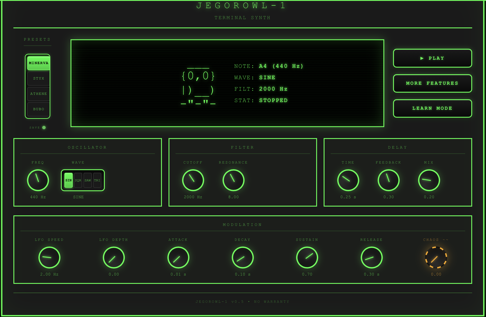

```
╔══════════════════════════════════════════════════════╗
║                                                      ║
║         JEGOROWL-1 :: TERMINAL SYNTH v0.4            ║
║                                                      ║
║                      ___                             ║
║                     (o,o)                            ║
║                    ((   ))                           ║
║                   --"-"-"-"--                        ║
║                                                      ║
║       [ MONOPHONIC · LEARN-MODE · WEB AUDIO ]        ║
║                                                      ║
╚══════════════════════════════════════════════════════╝
```

A web-based synthesizer with retro terminal aesthetics and an interactive learning mode. Built around the idea of understanding sound synthesis by clicking on it. 

> **Live:** [owl1.sebastianjegorow.de](https://owl1.sebastianjegorow.de) - JEGOROWL-1 plus music theory and a drum computer, all free in the browser. JEGOROWL-1 is the basic module of the suite.

## Overview

JEGOROWL-1 is a monophonic synthesizer that runs entirely in the browser.

**Special Feature:** The integrated **Learn Mode** makes sound synthesis understandable. Every parameter can be clicked to reveal detailed explanations - perfect for beginners.


## Features

### Audio Engine
- **Oscillator** with 4 waveforms (Sine, Square, Sawtooth, Triangle)
- **Lowpass Filter** with adjustable cutoff and resonance
- **LFO Modulation** for pulsating filter sweeps
- **ADSR Envelope** for precise volume control over time
- **Chaos Mode** for analog instability and experimental sounds

## How to use that thing

### Prerequisites
- A modern web browser (Chrome, Firefox, Safari, Edge)
- No installation required

### Learn Mode

1. Click the **LEARN MODE** button to activate
2. Click on any parameter control
3. Read the detailed explanation in the popup modal
4. Press ESC or click the close button to return

## Technical Details

### Architecture

**Frontend:**
- vanilla JS
- HTML
- Web Audio API for synthesis

## Versions

### v0.4 (Current)
- Added Learn Mode with detailed parameter explanations
- Implemented ADSR envelope
- Added Chaos mode for analog-style instability
- Created professor owl variant with glasses
- Improved UI responsiveness
- Boot sequence animation

### v0.3
- Added LFO modulation
- Implemented filter (cutoff + resonance)
- ASCII owl animations
- CRT scanline effects

### v0.2
- Basic oscillator with 4 waveforms
- Interactive knobs
- Real-time parameter display

### v0.1
- Initial prototype
- Simple sine wave generator

## Future Features

### Planned
- Preset system (save/load favorite sounds)
- Delay and reverb effects
- Keyboard input for playing notes
- MIDI support
- Polyphony (multiple notes)
- Additional filter types (highpass, bandpass)
- Sequencer/pattern mode
- Visual waveform display

## License

MIT License - feel free to use this project for learning, modification, or integration into your own projects.

---

```
   ___
  (o,o)
  |)__)
  -"-"-
```

*Made with terminal vibes. Base module of the [Owl1 suite](https://owl1.sebastianjegorow.de).*
